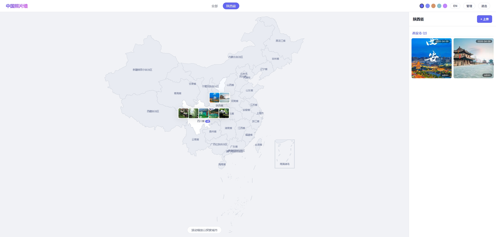
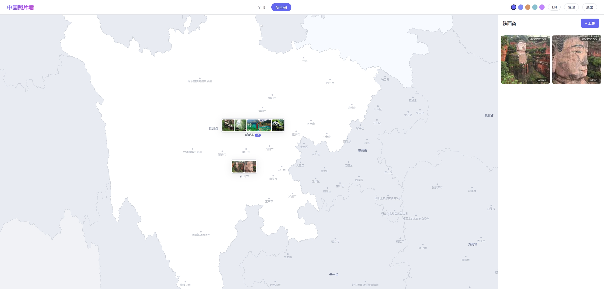
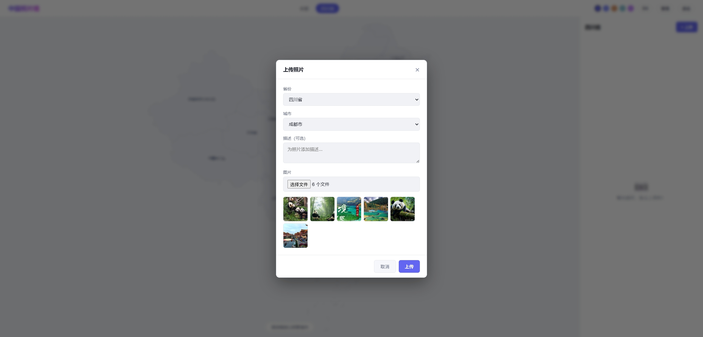

# 中国地图照片墙

[English](./README.md) | [简体中文](./README.zh-CN.md)

在交互式中国地图上展示你的照片足迹。上传照片时标记省份和城市，照片会自动显示在地图上对应的位置。支持多用户、评论互动、照片信息自动提取、完整移动端适配等功能。


## 效果展示

| 地图总览 | 城市级缩放 |
|:---:|:---:|
|  |  |

| 照片浏览 | 上传管理 |
|:---:|:---:|
|  |  |

## 主要功能

### 交互式地图
- **省市级地图展示** - 流畅缩放和平移，深入查看每个城市
- **照片地理标记** - 照片缩略图显示在地图上的对应位置
- **智能聚合** - 自动处理同一位置的多张照片，避免重叠
- **省会城市突出显示** - 省会始终显示蓝色圆点标识，上传照片后依然保留
- **省会自动匹配** - 未指定城市时自动关联到省会

### 照片管理
- **批量上传** - 一次最多上传20张照片，支持JPG、PNG、GIF、WebP、BMP格式（单张最大20MB）
- **信息提取** - 自动读取拍摄时间、相机型号、分辨率等照片信息
- **独立编辑弹窗** - 浏览与编辑分离，预览页面简洁，点击编辑按钮打开专用编辑弹窗
- **安全存储** - 本地文件系统存储，数据完全由你掌控

### 照片浏览
- **固定尺寸查看器** - 统一窗口大小（1100px x 92vh），图片严格等比缩放不超出
- **键盘导航** - 方向键切换照片，ESC关闭
- **缩放旋转** - 鼠标滚轮缩放，工具栏控件，支持照片旋转
- **上传者信息** - 图片元数据下方显示"上传者：xxx"

### 互动评论
- **嵌套回复** - 支持回复特定评论，形成对话线程
- **表情支持** - 内置200+emoji表情，行内表情选择器
- **访客友好** - 游客可浏览评论，登录后可发表

### 用户系统
- **角色管理** - 游客、普通用户、管理员三级权限
- **头像系统** - 选择默认头像或上传自定义头像
- **安全认证** - 加密密码存储，会话管理
- **用户管理** - 管理员可添加用户、重置密码、编辑显示名称

### 移动端支持
- **触摸优化地图** - 拖拽平移，专用 +/- 按钮缩放（不依赖手势缩放）
- **GeoJSON 代理** - 服务端代理消除移动端浏览器 CDN 403 访问问题
- **响应式布局** - 全屏弹窗、紧凑头部、优化触摸目标
- **性能优化** - 节流 overlay 更新，移动端降低网络并发

### 个性化
- **中英文界面** - 一键切换中英文，地图标签同步翻译
- **5种主题** - Light、Dark、Mocha、Nord、Berry任你挑选
- **跨平台** - Windows、macOS、Linux全平台支持

## 快速开始

### 环境要求
- [Go 1.21+](https://golang.org/dl/)

### 安装运行

```bash
# 克隆项目
git clone <repo-url>
cd my-travel-photo-wall

# 配置管理员账号
cp .env.example .env
# 编辑 .env 文件设置管理员用户名和密码

# 编译运行
go build -o main.exe .
./main.exe
```

程序会自动打开浏览器访问 `http://localhost:8080`

**Windows 用户**：直接双击 `start.bat` 即可

## 配置选项

编辑 `.env` 文件进行配置：

| 配置项 | 默认值 | 说明 |
|--------|--------|------|
| `PORT` | `8080` | 服务端口 |
| `AUTH_ENABLED` | `true` | 是否启用用户认证 |
| `ADMIN_USERNAME` | `admin` | 管理员用户名 |
| `ADMIN_PASSWORD` | `changeme` | 管理员密码 |
| `API_BASE_URL` | *(空)* | 远程API地址（可选） |
| `CORS_ORIGIN` | `*` | 跨域访问设置 |

## 项目结构

```
my-travel-photo-wall/
  main.go              # 后端服务（API、认证、GeoJSON代理、EXIF提取）
  static/              # 前端资源
    index.html         # 单页应用（上传、预览、编辑、登录、用户管理、头像选择弹窗）
    style.css          # 5种主题，响应式布局
    app.js             # 地图、覆盖层、认证、评论、国际化
    china.json         # 本地中国GeoJSON
    echarts.min.js     # ECharts包
    avatars/           # 默认头像SVG
  data/                # 数据库与缓存
    photowall.db       # SQLite（用户表、评论表）
    geo/               # 缓存的DataV CDN GeoJSON
  photos/              # 照片存储
    {省份}/
      {城市}/
        meta.json
        *.jpg/png/...
```

## 技术特点

- **单文件部署** - 无需安装额外数据库或服务，开箱即用
- **GeoJSON代理** - 后端代理DataV CDN并缓存，解决移动端403问题
- **本地存储** - 所有数据存储在本地，完全掌控你的数据
- **轻量高效** - 嵌入式数据库，启动快速，资源占用低
- **覆盖层性能** - 节流更新、拖拽时无CSS过渡动画、`contain`优化重绘
- **跨平台** - 支持Windows、macOS、Linux
- **现代前端** - 基于ECharts的交互式地图可视化

## 权限控制

| 角色 | 浏览 | 评论 | 上传/编辑/删除 | 用户管理 |
|------|--------|---------|-------------------|--------------|
| 游客 | 是 | 仅查看 | 否 | 否 |
| 用户 | 是 | 是 | 是 | 否 |
| 管理员 | 是 | 是 | 是 | 是 |

## 许可证

MIT
